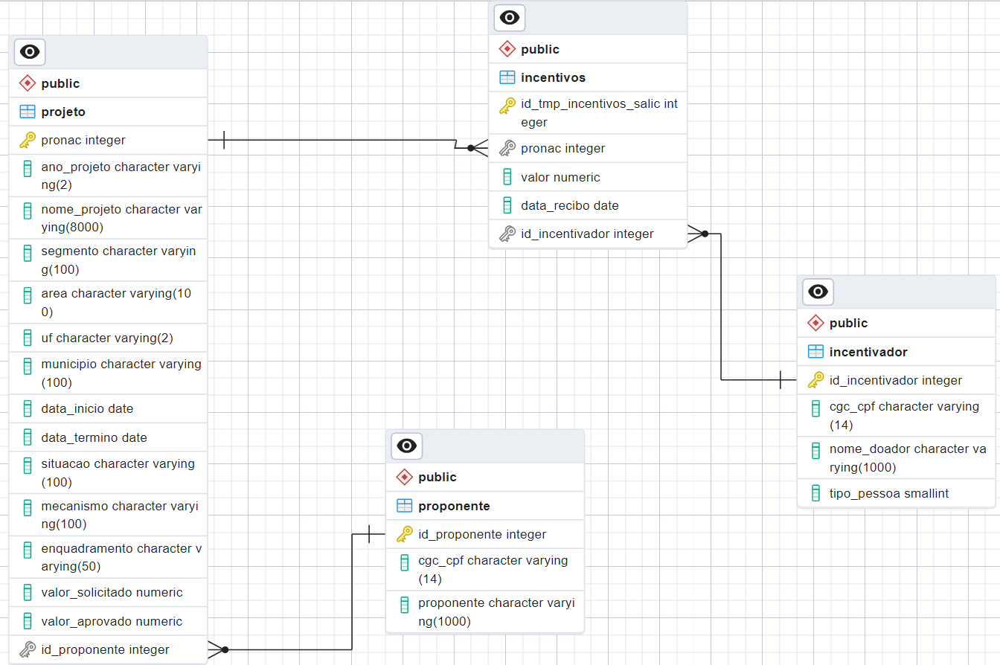

# Projeto: Desenvolvimento de Sistema de Banco de Dados Personalizado para Lei Rouanet

Este projeto faz parte da avaliação do módulo II do programa Santander Coders 2023.2, que aborda conceitos sobre Banco de Dados I. O objetivo é desenvolver um sistema de gerenciamento completo para a Lei Rouanet, desde a modelagem inicial até a implementação funcional do banco de dados.

### Lei Rouanet: Contextualização

A [Lei Rouanet](https://www.planalto.gov.br/ccivil_03/leis/l8313cons.htm), oficialmente conhecida como Lei Federal de Incentivo à Cultura, é um mecanismo de incentivo fiscal no Brasil que permite que empresas e pessoas físicas destinem parte do imposto devido para projetos culturais aprovados pelo [Ministério da Cultura](https://www.gov.br/cultura/pt-br). Ela é uma importante ferramenta de fomento à cultura no país, incentivando a realização de projetos culturais e a democratização do acesso à cultura.

## Bases de Dados utilizadas 
Para este projeto, serão utilizadas duas bases de dados no formato CSV. Essas bases contêm informações sobre os projetos culturais que solicitaram incentivos (*projetos_rouanet.csv*) e sobre os incentivos que foram ofertados (*incentivos_rouanet.csv*). Ambos os arquivos estão localizados na pasta [db_Rouanet](./db_Rouanet/) deste repositório.

## Normalização do Banco de Dados
Com relação às bases de dados originais disponíveis, temos duas tabelas (entidades) com suas respectivas colunas, conforme ilustrado na tabela a seguir:

| Entidade     | Atributos                                                             |
|--------------|-----------------------------------------------------------------------|
| Projeto      | pronac, ano_projeto, nome_projeto, cgc_cpf, proponente, segmento, area, uf, municipio, data_inicio, data_termino, situacao, mecanismo, enquadramento, valor_solicitado, valor_aprovado |
| Incentivos   | id_tmp_incentivos_salic, pronac, valor, data_recibo, nome_projeto, cgc_cpf, nome_doador, tipo_pessoa |

&nbsp;

> &#x1F4DD; **Obs:** A descrição desses atributos está detalhada na seção de [Documentação](#documentação).

&nbsp;

Para aplicar a normalização nas tabelas, vamos analisar a estrutura atual e identificar possíveis ajustes para garantir pelo menos a terceira forma normal (3FN).

### Proposta de Normalização:

1. **Tabela Projeto:**
   - Manter os atributos: pronac, ano_projeto, nome_projeto, segmento, area, uf, municipio, data_inicio, data_termino, situacao, mecanismo, enquadramento, valor_solicitado, valor_aprovado.
  
   - A chave primária da tabela "Projeto" será **pronac**.
  
   - Criar uma tabela "Proponente" com os atributos: cgc_cpf, proponente.
  
   - A nova tabela “Proponente” incluirá um novo atributo **id_proponente** como chave primária (número serial gerado automaticamente pelo PostgreSQL), para contornar a restrição de não poder usar o *cgc_cpf* como chave primária. Isso ocorre porque, no caso de um CPF ser fornecido, parte dele será substituída por asteriscos para preservar a privacidade do titular. Essa abordagem garantirá a unicidade dos registros sem expor dados sensíveis. 
    
   - A tabela "Projeto" terá uma chave estrangeira *id_proponente* referenciando a tabela Proponente.

2. **Tabela Incentivos:**
   - Manter os atributos: id_tmp_incentivos_salic, pronac, valor, data_recibo.
  
   - A chave primária será o **id_tmp_incentivos_salic**.
  
   - Criar uma tabela "Incentivador" com os atributos: cgc_cpf, nome_doador, tipo_pessoa.
  
   - A nova tabela "Incentivador" incluirá um novo atributo **id_incentivador** como chave primária (número serial gerado automaticamente pelo PostgreSQL).
  
   - A tabela "Incentivos" terá uma chave estrangeira *id_incentivador* referenciando a tabela Incentivador.

### Vantagens e Desvantagens do Processo de Normalização:

**Vantagens:**
- Redução da redundância de dados, o que economiza espaço de armazenamento.
- Minimização das chances de inconsistência nos dados.
- Facilitação da manutenção e atualização dos dados.
- Melhoria na performance das consultas, especialmente em bases de dados grandes.

**Desvantagens:**
- Possível aumento da complexidade das consultas, devido à necessidade de realizar joins entre tabelas.
- Pode ser necessário reestruturar consultas existentes para se adequarem à nova estrutura normalizada.
- Em algumas situações, pode haver um ligeiro aumento na complexidade do design do banco de dados.

&nbsp;

## Descrição do Modelo de Entidade e Relacionamento

### Tabela de Entidades e Atributos atualizada:

| Entidade     | Atributos                                                             |
|--------------|----------------------------------------------------------------------|
| Projeto      | **pronac** (PK), ano_projeto, nome_projeto, segmento, area, uf, municipio, data_inicio, data_termino, situacao, mecanismo, enquadramento, valor_solicitado, valor_aprovado, *id_proponente* (FK) |
| Proponente   | **id_proponente** (PK), cgc_cpf, proponente                  |
| Incentivos   | **id_tmp_incentivos_salic** (PK), *pronac* (FK), valor, data_recibo, *id_incentivador* (FK)          |
| Incentivador | **id_incentivador** (PK), cgc_cpf, nome_doador, tipo_pessoa  |

### Relacionamentos:

1. Projeto - Proponente (1:N): Um projeto tem um único proponente, mas um proponente pode estar associado a vários projetos.
2. Projeto - Incentivos (1:N): Um projeto pode ter vários incentivos, mas um incentivo está associado a apenas um projeto.
3. Incentivos - Incentivador (N:1): Um incentivo tem um único incentivador, mas um incentivador pode ter vários incentivos.

### Diagrama Entidade-Relacionamento

## Implementação do Banco de Dados

[em construção ...]

## Criação de Views

[em construção ...]

&nbsp;

## Autores

- [@andreaseliass](https://github.com/andreaseliass)
- [@AnthonyHeimlich](https://github.com/AnthonyHeimlich)
- [@evertondcavalcante](https://github.com/evertondcavalcante)
- [@JuliaMidoriRW](https://github.com/JuliaMidoriRW)
- [@luana-kruger](https://github.com/luana-kruger)

&nbsp;

## Documentação

#### Entidades e Atributos (das bases de dados originais):

1. **Projeto**
   - **pronac**: Identificador único do projeto no Ministério da Cultura.
   - **ano_projeto**: Os últimos dois dígitos do ano de cadastro do projeto na Lei Rouanet.
   - **nome_projeto**: Nome do projeto ao qual o incentivo está associado.
   - **cgc_cpf**: CNPJ (CGC) ou CPF do proponente do projeto (CPF ocultado por questões de privacidade).
   - **proponente**: Nome do proponente do projeto.
   - **segmento**: Segmento artístico-cultural ao qual o projeto pertence.
   - **area**: Área temática do projeto cultural.
   - **uf**: Estado onde o projeto será executado.
   - **municipio**: Município onde o projeto será executado.
   - **data_inicio**: Data de início prevista para o projeto.
   - **data_termino**: Data de término prevista para o projeto.
   - **situacao**: Estado atual do processo de aprovação do projeto.
   - **mecanismo**: Forma de captação de recursos para o projeto.
   - **enquadramento**: Artigo específico da Lei Rouanet no qual o projeto se enquadra.
   - **valor_solicitado**: Valor solicitado para captação de recursos.
   - **valor_aprovado**: Valor aprovado pelo Ministério da Cultura para o projeto.

2. **Incentivos**
   - **Id_tmp_incentivos_salic**: Identificador temporário do registro.
   - **pronac**: Identificador único do projeto no Ministério da Cultura.
   - **valor**: Valor do incentivo financeiro concedido ao projeto.
   - **data_recibo**: Data de recebimento do incentivo.
   - **nome_projeto**: Nome do projeto ao qual o incentivo está associado.
   - **cgc_cpf**: CNPJ (CGC) ou CPF do incentivador do projeto (CPF ocultado por questões de privacidade).
   - **nome_doador**: Nome do incentivador.
   - **tipo_pessoa**: Tipo de pessoa do incentivador (valor 0 para física e 1 para jurídica).

#### Observações:

- Para o campo *cgc_cpf* ser um CPF, ele é ocultado por questões de privacidade, seguindo as diretrizes da LGPD (Lei Geral de Proteção de Dados). Isso significa que, quando um CPF é armazenado no banco de dados, parte dele é substituído por asteriscos, preservando assim a privacidade do titular do CPF. Por esse motivo, esse campo não é adequado para ser usado como chave primária, pois não é uma informação única e identificável de forma direta.
  
- O CGC é Cadastro Geral de Contribuintes, um número de identificação fiscal que era utilizado no Brasil até 1998. Atualmente, esse número é conhecido como CNPJ (Cadastro Nacional da Pessoa Jurídica).
