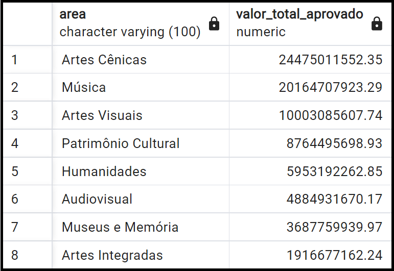
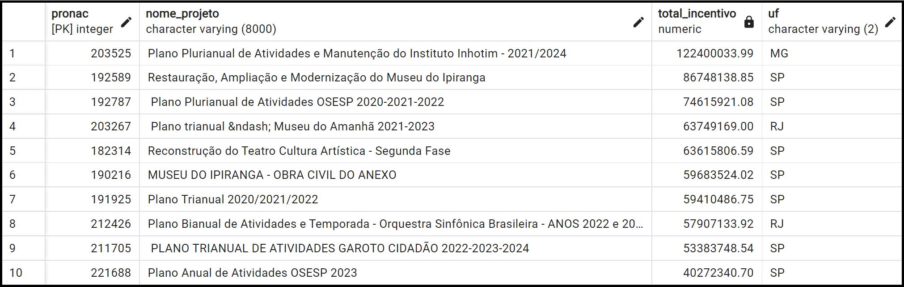

# Projeto: Desenvolvimento de Sistema de Banco de Dados Personalizado para Lei Rouanet

Este projeto faz parte da avaliação do módulo II do programa Santander Coders 2023.2, que aborda conceitos sobre Banco de Dados I. O objetivo é desenvolver um sistema de gerenciamento completo para a Lei Rouanet, desde a modelagem inicial até a implementação funcional do banco de dados.

### Lei Rouanet: Contextualização

A [Lei Rouanet](https://www.planalto.gov.br/ccivil_03/leis/l8313cons.htm), oficialmente conhecida como Lei Federal de Incentivo à Cultura, é um mecanismo de incentivo fiscal no Brasil que permite que empresas e pessoas físicas destinem parte do Imposto de Renda (IR) devido para projetos culturais aprovados pelo [Ministério da Cultura](https://www.gov.br/cultura/pt-br). Ela é uma importante ferramenta de fomento à cultura no país, incentivando a realização de projetos culturais e a democratização do acesso à cultura.

## Bases de Dados utilizadas 
Para este projeto, serão utilizadas duas bases de dados no formato CSV. Essas bases contêm informações sobre os projetos culturais que solicitaram incentivos (*projetos_rouanet.csv*) e sobre os incentivos que foram ofertados (*incentivos_rouanet.csv*). Ambos os arquivos estão localizados na pasta [db_Rouanet](./db_Rouanet/) deste repositório.

## Normalização do Banco de Dados
Com relação às bases de dados originais disponíveis, temos duas tabelas (entidades) com suas respectivas colunas, conforme ilustrado na tabela a seguir:

| Entidade     | Atributos                                                             |
|--------------|-----------------------------------------------------------------------|
| Projeto      | pronac, ano_projeto, nome_projeto, cgc_cpf, proponente, segmento, area, uf, municipio, data_inicio, data_termino, situacao, mecanismo, enquadramento, valor_solicitado, valor_aprovado |
| Incentivos   | id_tmp_incentivos_salic, pronac, valor, data_recibo, nome_projeto, cgc_cpf, nome_doador, tipo_pessoa |

&nbsp;

> &#x1F4DD; **Obs:** A descrição desses atributos está detalhada na seção de [Documentação](#documentação).

&nbsp;

Para aplicar a normalização nas tabelas, vamos analisar a estrutura atual e identificar possíveis ajustes para garantir pelo menos a terceira forma normal (3FN).

### Proposta de Normalização:

1. **Tabela Projeto:**
   - Manter os atributos: pronac, ano_projeto, nome_projeto, segmento, area, uf, municipio, data_inicio, data_termino, situacao, mecanismo, enquadramento, valor_solicitado, valor_aprovado.
  
   - A chave primária da tabela "Projeto" será **pronac**.
  
   - Criar uma tabela "Proponente" com os atributos: cgc_cpf, proponente.
  
   - A nova tabela “Proponente” incluirá um novo atributo **id_proponente** como chave primária (número serial gerado automaticamente pelo PostgreSQL), para contornar a necessidade de termos de usar o *cgc_cpf* e o *proponente* como chave primária composta. Isso ocorre porque, no caso de um CPF ser fornecido, parte dele será substituída por asteriscos para preservar a privacidade do titular, sendo então necessário também utilizar o nome para garantir a unicidade dos dados. Essa abordagem garantirá a unicidade dos registros sem expor dados sensíveis e sem a necessidade de uma chave composta nos relacionamentos. 
    
   - A tabela "Projeto" terá uma chave estrangeira *id_proponente* referenciando a tabela Proponente.

2. **Tabela Incentivos:**
   - Manter os atributos: pronac, valor, data_recibo.
  
   - A chave primária será o **id_incentivo**, uma chave primária substituta.
  
   - Criar uma tabela "Incentivador" com os atributos: cgc_cpf, nome_doador, tipo_pessoa.
  
   - A nova tabela "Incentivador" incluirá um novo atributo **id_incentivador** como chave primária (número serial gerado automaticamente pelo PostgreSQL) devido a mesma situação apresentada na tabela "Proponente".
  
   - A tabela "Incentivos" terá uma chave estrangeira *id_incentivador* referenciando a tabela Incentivador.

### Vantagens e Desvantagens do Processo de Normalização:

**Vantagens:**
- Redução da redundância de dados, o que economiza espaço de armazenamento.
- Minimização das chances de inconsistência nos dados.
- Facilitação da manutenção e atualização dos dados.
- Melhoria na performance das consultas, especialmente em bases de dados grandes.

**Desvantagens:**
- Possível aumento da complexidade das consultas, devido à necessidade de realizar joins entre tabelas.
- Pode ser necessário reestruturar consultas existentes para se adequarem à nova estrutura normalizada.
- Em algumas situações, pode haver um ligeiro aumento na complexidade do design do banco de dados.

&nbsp;

## Descrição do Modelo de Entidade e Relacionamento

### Tabela de Entidades e Atributos atualizada:

| Entidade     | Atributos                                                             |
|--------------|----------------------------------------------------------------------|
| Projeto      | **pronac** (PK), ano_projeto, nome_projeto, segmento, area, uf, municipio, data_inicio, data_termino, situacao, mecanismo, enquadramento, valor_solicitado, valor_aprovado, *id_proponente* (FK) |
| Proponente   | **id_proponente** (PK), cgc_cpf, proponente                  |
| Incentivos   | **id_incentivo** (PK), *pronac* (FK), valor, data_recibo, *id_incentivador* (FK)          |
| Incentivador | **id_incentivador** (PK), cgc_cpf, nome_doador, tipo_pessoa  |

### Relacionamentos:

1. Projeto - Proponente (1:N): Um projeto tem um único proponente, mas um proponente pode estar associado a vários projetos.
2. Projeto - Incentivos (1:N): Um projeto pode ter vários incentivos, mas um incentivo está associado a apenas um projeto.
3. Incentivos - Incentivador (N:1): Um incentivo tem um único incentivador, mas um incentivador pode ter vários incentivos.

### Diagrama Entidade-Relacionamento

## Implementação do Banco de Dados

Na pasta [Scripts](./Scripts/) deste repositório, estão contidos sete scripts SQL elaborados para implementar o banco de dados destinado a armazenar informações relacionadas à Lei Rouanet. Esses scripts utilizam os dados presentes na pasta [db_Rouanet](./db_Rouanet/), que incluem informações sobre projetos, proponentes, incentivos, entre outros. O objetivo é facilitar consultas e análises desses dados. 

A seguir, apresenta-se a descrição de cada um desses scripts:

- **[Script 1](./Scripts/1-criacao_database.sql) - Criar Banco de Dados**:
   - Nome: `db_dados_rouanet`
   - Encoding: UTF8
   - Limitação de Conexão: Ilimitada

- **[Script 2](./Scripts/2-criacao_schema_stage.sql) - Criar Esquema**:
   - Nome: `stage` (para área de stage) 
   > O esquema *stage* é usado para armazenar temporariamente os dados brutos ou semiestruturados antes que sejam transformados e carregados no esquema final de produção.

- **[Script 3](./Scripts/3-criacao_tabelas_stage.sql) - Criar Tabelas Stage e índices**:
   - `stg_projeto_nao_normalizado` (Stage de Projetos)
   - `stg_incentivo_nao_normalizado` (Stage de Incentivos)
   - `ix_proponente` (Proponente)
   - `ix_projeto` (Projeto)
   - `ix_incentivador` (Incentivador)
   - `ix_projeto_incentivado` (Projeto Incentivado)
  
- **[Script 4](./Scripts/4-populacao_tabelas_stage.sql) - Carregar Dados**:
   - Arquivo CSV de Projetos em `stg_projeto_nao_normalizado`
   - Arquivo CSV de Incentivos em `stg_incentivo_nao_normalizado`

- **[Script 5](./Scripts/5-criacao_tabelas_normalizadas.sql) - Criar Tabelas Normalizadas**:
   - `Proponente` (Tabela de Proponentes)
   - `Projeto` (Tabela de Projetos)
   - `Incentivador` (Tabela de Incentivadores)
   - `Incentivos` (Tabela de Incentivos)

- **[Script 6](./Scripts/6-carregamento_tabelas_normalizadas.sql) - Carregar dados nas Tabelas Normalizadas**:
   - `Proponente` (Insere dados únicos de CGC/CPF e nome de proponentes do arquivo de projetos não normalizado - *stg_projeto_nao_normalizado*)
   - `Projeto` (Insere dados de projetos do arquivo de projetos não normalizado )
   - `Incentivador` (Insere dados únicos de CGC/CPF, nome doador e tipo de pessoa (física ou jurídica) do arquivo de incentivos não normalizado - *stg_incentivo_nao_normalizado*)
   - `Incentivos` (Insere dados de incentivos do arquivo de incentivos não normalizado, recuperando o ID do incentivador)

- **[Script 7](./Scripts/7-criacao_views.sql) - Criar Views**:
   - `view_valor_total_por_area`
   - `view_projetos_aprovados_por_area`
   - `view_projetos_por_area_situacao`
   - `view_quantidade_projetos_por_estado`
   - `view_projetos_ordem_valor_aprovado`
   - `view_projetos_maior_valor_solicitado`
   - `view_projetos_aprovados_acima_media`
   - `view_projetos_mais_incentivados`
   - `incentivador_mais_doou`
   - `projetos_maior_diferenca`

&nbsp;

## Criação de Views

Conforme a [Secretaria de Comunicação Social]( https://www.gov.br/secom/pt-br/fatos/brasil-contra-fake/noticias/2023/3/o-que-voce-precisa-saber-sobre-a-lei-rouanet), a Lei Federal de Incentivo à Cultura opera mediante renúncia fiscal de empresas que direcionam parte de seus impostos para o incentivo à cultura. Por meio desse mecanismo, as empresas podem deduzir até 4% do Imposto de Renda da próxima declaração.

Para obter informações importantes sobre os dados de incentivos à cultura do país, podemos utilizar ***views***, que são consultas armazenadas que se comportam como tabelas virtuais. Isso permite aos usuários acessar e manipular os dados de forma simplificada e segura. As ***views*** podem ser uma ferramenta poderosa para gerar *insights* sobre o banco de dados, pois possibilitam a criação de visões personalizadas dos dados, facilitando análises complexas e a obtenção de informações específicas.

No [script 7](./Scripts/7-criacao_views.sql), são criadas algumas ***views*** que permitem discutir informações sobre os projetos e incentivos que utilizam a Lei Rouanet. É importante primeiro verificar quais áreas são contempladas pela lei e quanto cada área arrecadou desde o primeiro incentivo, lembrando que essa lei está em vigor desde 1991.

A primeira ***view*** do [script 7](./Scripts/7-criacao_views.sql) apresenta o valor total aprovado para projetos agrupados por área:

<!--  -->

Aqui podemos destacar duas informações. Primeiramente, podemos identificar quais são as formas de expressão cultural contempladas pela Lei Rouanet, são oito. Em segundo lugar, entre as formas artísticas contempladas, aquelas que receberam maior fomento desde o início da lei são as Artes Cênicas (circo, dança, mímica, ópera, teatro e similares) e a Música (música popular, instrumental e erudita, além de canto coral), ambas com incentivos totais na ordem dos 20 bilhões de reais. Essas áreas também são as que mais tiveram projetos aprovados, conforme evidenciado pela ***view 2*** ([script 7](./Scripts/7-criacao_views.sql)).

Para obter a quantidade de projetos por estado, utilizaremos a ***view 4***:

<!--  -->

É perceptível que os seis primeiros estados são do eixo sul-sudeste. Em sétimo lugar, temos o estado da Bahia, com 4406 projetos, o que representa aproximadamente um oitavo do número de projetos do primeiro colocado, que é o estado de São Paulo. 

De fato, ao analisarmos o resultado da **view 8**, que mostra os 10 projetos que receberam o maior valor total de incentivos, observamos que todos esses projetos estão localizados na região sudeste do país. Isso revela a concentração dos recursos captados por meio da Lei Rouanet nessa região.

A concentração dos recursos da Lei Rouanet na região sudeste do Brasil se deve principalmente à infraestrutura cultural mais desenvolvida, ao maior mercado consumidor, à presença dos principais centros urbanos e à maior facilidade das empresas locais em captar recursos por meio de incentivos fiscais. Esses fatores combinados acabam atraindo mais investimentos e projetos culturais para essa região em comparação com outras partes do país. 

Essa concentração dos recursos da Lei Rouanet na região sudeste do Brasil também evidencia como a desigualdade presente no país se reflete até mesmo na cultura, com uma distribuição desproporcional de investimentos e oportunidades entre as diferentes regiões. Essa realidade destaca a importância de políticas culturais que busquem promover uma maior democratização do acesso à cultura em todo o território nacional.

Através do [script 7](./Scripts/7-criacao_views.sql), é possível obter diversos *insights* adicionais, mas para manter a discussão concisa, abordamos alguns dos pontos mais relevantes ao analisar os dados dos incentivos à cultura. Em resumo, a cultura é um dos grandes orgulhos nacionais do Brasil, seja pela produção musical diversificada, pelas obras audiovisuais, pelas festas populares ou pelas diversas manifestações artísticas. A cultura desempenha um papel fundamental na geração de empregos, renda e conhecimento. Nesse contexto, a Lei Rouanet assume grande importância, evidenciando seu claro objetivo de fomentar a cultura no país.

&nbsp;

## Autores

- [@andreaseliass](https://github.com/andreaseliass)
- [@AnthonyHeimlich](https://github.com/AnthonyHeimlich)
- [@evertondcavalcante](https://github.com/evertondcavalcante)
- [@JuliaMidoriRW](https://github.com/JuliaMidoriRW)
- [@luana-kruger](https://github.com/luana-kruger)

&nbsp;

## Documentação

#### Entidades e Atributos (das bases de dados originais):

1. **Projeto**
   - **pronac**: Identificador único do projeto no Ministério da Cultura.
   - **ano_projeto**: Os últimos dois dígitos do ano de cadastro do projeto na Lei Rouanet.
   - **nome_projeto**: Nome do projeto ao qual o incentivo está associado.
   - **cgc_cpf**: CNPJ (CGC) ou CPF do proponente do projeto (CPF ocultado por questões de privacidade).
   - **proponente**: Nome do proponente do projeto.
   - **segmento**: Segmento artístico-cultural ao qual o projeto pertence.
   - **area**: Área temática do projeto cultural.
   - **uf**: Estado onde o projeto será executado.
   - **municipio**: Município onde o projeto será executado.
   - **data_inicio**: Data de início prevista para o projeto.
   - **data_termino**: Data de término prevista para o projeto.
   - **situacao**: Estado atual do processo de aprovação do projeto.
   - **mecanismo**: Forma de captação de recursos para o projeto.
   - **enquadramento**: Artigo específico da Lei Rouanet no qual o projeto se enquadra.
   - **valor_solicitado**: Valor solicitado para captação de recursos.
   - **valor_aprovado**: Valor aprovado pelo Ministério da Cultura para o projeto.

2. **Incentivos**
   - **Id_tmp_incentivos_salic**: Identificador temporário do registro.
   - **pronac**: Identificador único do projeto no Ministério da Cultura.
   - **valor**: Valor do incentivo financeiro concedido ao projeto.
   - **data_recibo**: Data de recebimento do incentivo.
   - **nome_projeto**: Nome do projeto ao qual o incentivo está associado.
   - **cgc_cpf**: CNPJ (CGC) ou CPF do incentivador do projeto (CPF ocultado por questões de privacidade).
   - **nome_doador**: Nome do incentivador.
   - **tipo_pessoa**: Tipo de pessoa do incentivador (valor 0 para física e 1 para jurídica).

#### Observações:

- Para o campo *cgc_cpf* ser um CPF, ele é ocultado por questões de privacidade, seguindo as diretrizes da LGPD (Lei Geral de Proteção de Dados). Isso significa que, quando um CPF é armazenado no banco de dados, parte dele é substituído por asteriscos, preservando assim a privacidade do titular do CPF. Por esse motivo, esse campo não é adequado para ser usado como chave primária, pois não é uma informação única e identificável de forma direta.
  
- O CGC é Cadastro Geral de Contribuintes, um número de identificação fiscal que era utilizado no Brasil até 1998. Atualmente, esse número é conhecido como CNPJ (Cadastro Nacional da Pessoa Jurídica).
